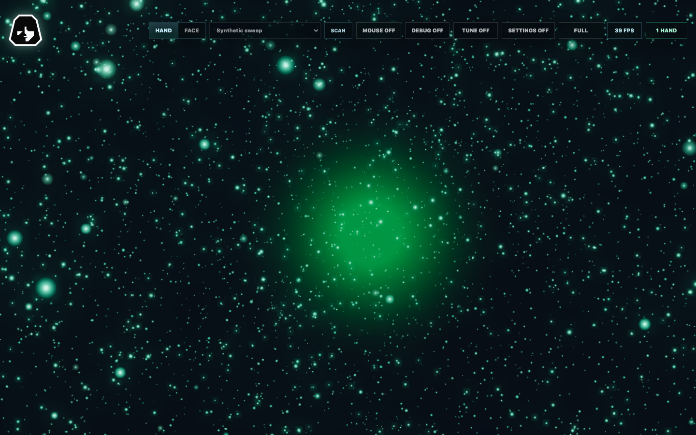

# Reactive Particle Demo

An interactive browser prototype that turns live hand and face landmarks from a webcam into a GPU-rendered Three.js particle field. MediaPipe inference and rendering run on the user's device, while React stays focused on the controls and status UI.

**[Open the live demo](https://reactive-particle-demo.okan.workers.dev/)** — choose `MOUSE` for the no-camera interaction path, or opt into `HAND` or `FACE` after reviewing the privacy notes below.



## What it demonstrates

- Hand mode maps fingertips, palms, pinches, sweeps, and claps to particle forces and shockwaves.
- Face mode forms a particle mask that follows pose, blinks, smiles, and head movement.
- An adaptive 18,000-100,000 particle budget responds to device and render pressure.
- Tracking, filtering, and Three.js animation loops stay outside React's render cycle.
- Calibration, particle tuning, camera selection, fullscreen, mouse input, and reduced-motion behavior are built in.
- Synthetic browser checks exercise hand/face filters, tracking recovery, controls, and rendered output without requiring a webcam.

## Project status

This is a working showcase prototype, not a release-ready application. The production build and both synthetic verification suites pass locally and against the [public Cloudflare deployment](https://reactive-particle-demo.okan.workers.dev/). Each suite starts its own isolated Vite server by default so a stale or concurrently stopped development server cannot contaminate the result; an explicit base URL runs the same behavioral checks against the deployed origin.

## Privacy and browser requirements

- Camera frames are processed in the browser and are not uploaded by this application.
- The first run downloads the MediaPipe WASM runtime and landmark models from jsDelivr and Google-hosted model storage.
- Webcam access requires `https://` or a trusted local origin such as `localhost`.
- A modern browser with WebGL is required. Mouse mode provides a no-camera interaction path.

## Run locally

```bash
npm ci
npm run dev
```

Open the printed local URL, allow camera access, and choose `HAND` or `FACE`. Use the `MOUSE` control to interact without a camera.

## Verify and build

```bash
npm run build
npm run verify:hand
npm run verify:face
```

The verification scripts start Vite automatically when needed and use Playwright with synthetic tracking inputs.

The README image is captured from that same synthetic path, so it does not contain webcam footage or personal data. Regenerate it with `npm run capture:showcase` after installing Playwright's Chromium browser.

To stress a specific hand behavior, select one or more profiles and repeat them in the same isolated run:

```bash
HAND_VERIFY_PROFILES=drop,sweep HAND_VERIFY_REPEAT=5 npm run verify:hand
```

## Architecture

| Path | Responsibility |
|---|---|
| `src/App.jsx` | React HUD, mode controls, debug view, calibration, and settings panels |
| `src/main.js` | Camera lifecycle, MediaPipe inference, tracking filters, and Three.js scene orchestration |
| `src/engine/` | Particle constants, math helpers, and GPU shaders |
| `scripts/verify-*.mjs` | Synthetic hand/face behavior and visual regression checks |
| `wrangler.jsonc` | Optional Cloudflare Workers static-assets deployment |

## Deployment

The verified public demo is served as static assets at [reactive-particle-demo.okan.workers.dev](https://reactive-particle-demo.okan.workers.dev/). The deployment has no server-side application code, data bindings, or secrets. Build and deploy it after authenticating Wrangler:

```bash
npm run build
npx wrangler deploy
```

After deployment, verify both synthetic modes against the public origin rather than treating a successful upload as application proof:

```bash
HAND_VERIFY_BASE_URL=https://reactive-particle-demo.okan.workers.dev npm run verify:hand
FACE_VERIFY_BASE_URL=https://reactive-particle-demo.okan.workers.dev npm run verify:face
```

## License

No license is currently granted for this repository. The source is public for inspection, but copying, modification, or redistribution requires permission from the copyright holder. Third-party libraries, MediaPipe runtime/models, and brand assets remain subject to their respective terms.
